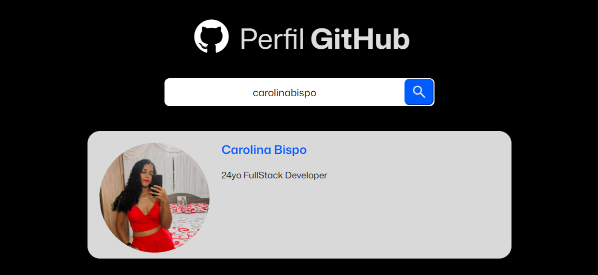
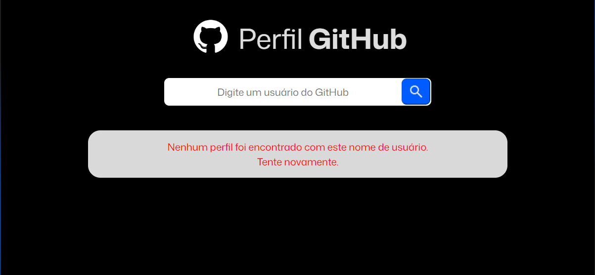

# Teste tecnico para estágio Avanti 
## Descrição do Projeto
Projeto desenvolvido como desafio final, com o objetivo de recriar um layout do Figma utilizando React e JavaScript para funcionalidades interativas.

🔗 Acesse o layout original no Figma:
[Figma - Innovation Class] (https://www.figma.com/proto/DqtFxC6312M32mLt8FpJjq/innovation-class?page-id=22%3A2864&node-id=22-4293&viewport=359%2C115%2C0.25&t=SHsEqEgaMrXGMKwv-1&scaling=scale-down-width&content-scaling=fixed&starting-point-node-id=22%3A4293&show-proto-sidebar=1)

##Para visualizar o projeto completo, faça o clone desse repositório utlizando o seguinte link: 

https://github.com/carolinabispo/projeto-busca-github-avanti-com-react.git

✅ Requisitos Atendidos
1️⃣ Criar um campo de busca

O projeto possui um campo de busca onde o usuário poode digitar o nome de um perfil do github

2️⃣ Integração de API

Ao clicar no botão de busca, será exibido as seguintes informações do usuário:

- Nome do usuário
- Foto de perfil
- Bio

3️⃣ Exibir mensagens de erro 

Caso o perfil não seja encontrado será exibido a seguinte mensagem: 

